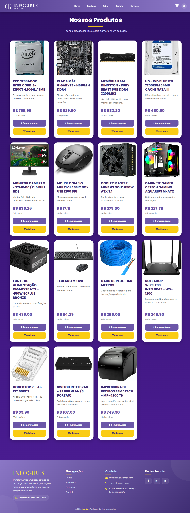
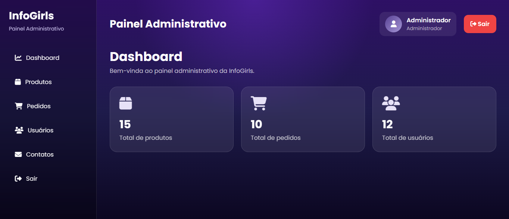
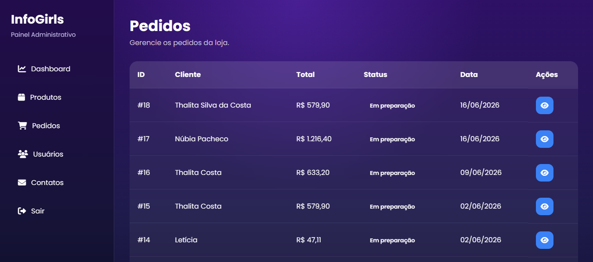
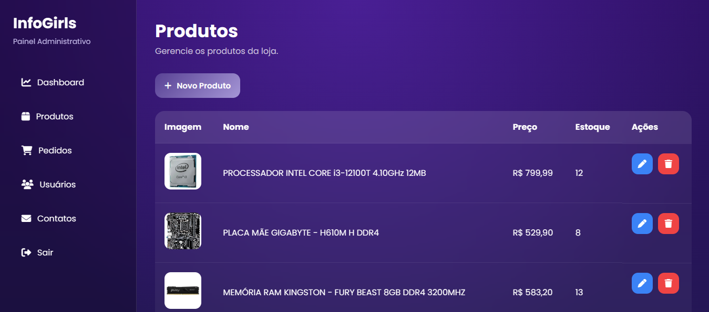

# 💻 InfoGirls

Sistema web desenvolvido para uma empresa de informatização, oferecendo uma plataforma completa para venda de peças de informática e gerenciamento administrativo.

## 🌐 Demonstração

🔗 https://infogirls.onrender.com

> **Observação:** Como o sistema está hospedado no plano gratuito do Render, o primeiro acesso pode levar alguns segundos para carregar.

---

## 🚀 Tecnologias Utilizadas

- HTML5
- CSS3
- JavaScript
- PHP
- PostgreSQL
- SendGrid
- Render

---

## ✨ Funcionalidades

- Cadastro de usuários
- Login
- Recuperação de senha por e-mail
- Catálogo de produtos
- Carrinho de compras
- Finalização de pedidos
- Histórico de pedidos
- Área de contato
- Painel administrativo
- Gerenciamento de produtos
- Gerenciamento de usuários
- Gerenciamento de pedidos

---

## 📸 Principais Telas

### 🏠 Página Inicial

Página inicial da InfoGirls, apresentando a empresa, seus serviços, produtos em destaque, depoimentos de clientes e informações de contato.

---

### 🛒 Catálogo de Produtos

Catálogo com peças de informática contendo imagens, descrição, preço, quantidade disponível e opções para adicionar ao carrinho ou comprar diretamente.

---

### 🔐 Autenticação

Sistema de autenticação para acesso às funcionalidades destinadas aos clientes e administradores.

---

### ✅ Confirmação do Pedido

Após finalizar a compra, o sistema apresenta um resumo completo do pedido, incluindo produtos adquiridos, endereço de entrega, frete e valor total.

---

### 📦 Histórico de Pedidos

Área onde o cliente pode consultar os pedidos realizados, organizados cronologicamente.

---

### 📊 Dashboard Administrativa

Painel inicial do administrador com indicadores rápidos sobre usuários, produtos e pedidos cadastrados.

---

### 📋 Gerenciamento de Pedidos

Tela destinada ao acompanhamento dos pedidos realizados, permitindo visualizar os detalhes de cada compra.

---

### 📦 Gerenciamento de Produtos

Área administrativa para cadastrar, editar e remover produtos do catálogo.

